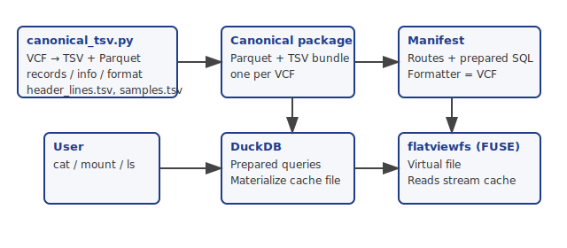

# Introduction

This report describes the design and implementation of a tool that serves a virtual flat-file view over data stored in a relational representation. The central idea is to preserve the queryability and compact storage of a tabular backend while exposing the data through a conventional file interface that can be inspected with standard filesystem operations. In this work, compressed storage is provided through Apache Parquet, a columnar format designed for efficient storage and retrieval with built-in compression and encoding support, while DuckDB is used as the embedded analytical database managing the relational view of the data. The file-oriented presentation layer is implemented with FUSE, which enables user-space programs to export filesystems to the kernel and thereby present generated content as ordinary files. 

As a concrete demonstration, the tool is applied to genomic variant data represented in Variant Call Format (VCF). VCF is a text-based format consisting of meta-information lines, a header, and tab-delimited variant records with genotype information for one or more samples, making it a natural target for virtual flat-file materialization from relational tables. This setting provides a useful test case because VCF combines structured schema-like fields with a strict textual serialization, allowing the system to illustrate how relational records can be reconstructed into a standards-compliant, human-readable file without duplicating the underlying dataset. 

# Architecture

## Canonical VCF to Parquet pipeline
The `vcf/canonical_tsv.py` script parses a VCF (optionally gzipped), normalizes header definitions, and exports a canonical package with TSVs and typed Parquet files:

- `records.parquet`, `record_alt.parquet`, `record_filter.tsv`: structural record tables.
- One Parquet per INFO signature and one per FORMAT signature; signature registries (`info_signatures.tsv`, `format_signatures.tsv`) plus field mappings keep the schema explicit.
- Sample registry (`samples.tsv`) and header lines (`header_lines.tsv`) preserve ordering and content for round-trip fidelity.
DuckDB is used in the script to type columns and emit compressed Parquet, matching the schema it later queries in flatviewfs.

## flatviewfs materialization path
flatviewfs mounts virtual files via FUSE. A manifest declares routes, a glob of source Parquet files, and the formatter to render results. For VCF:

- The route uses prepared SQL to read canonical Parquet/TSV tables and assemble rows with `chrom`, `pos`, `ref/alt`, `qual/filter`, and sample-specific FORMAT/INFO values.
- The VCF formatter loads signature metadata from TSVs, looks up per-record/per-sample rows, and reconstructs INFO and FORMAT/sample strings; headers are taken from the canonical `header_lines.tsv`.
- Materialization jobs run in worker threads; outputs stream into a cache entry that backs the virtual file. Reads block until data is available; subsequent opens reuse the cached result.
- User parameters (e.g., sample identifiers) are bound as prepared-statement parameters; only file paths are injected as literals because DuckDB table functions require literal paths.

# Results
Our prototype mounts DuckDB query outputs as read-only files and reconstructs VCF text from the canonical TSV/Parquet packages emitted by `canonical_tsv.py`. Two classes of tests demonstrate functional coverage:

- **Synthetic smoke tests** recreate tiny CSV and VCF outputs directly from DuckDB tables to validate formatter wiring and cache materialization.
- **Canonical reconstruction** consumes the generated package for `0GOOR_HG002_subset` and produces a byte-for-byte identical VCF, proving that INFO/FORMAT/sample fields can be rehydrated from the split Parquet/TSV bundle without re-reading the original VCF text.

Materialization is driven by prepared statements; user parameters (e.g., sample IDs) are bound positionally, while file-path literals are injected only for DuckDB table functions that require static strings. 

How to build and run: clone the code (`git clone https://github.com/ecrum19/flatviewfs`), then `cargo test -- --nocapture` for the smoke tests, or `cargo run -- --manifest examples/vcf-canonical.toml --mountpoint /tmp/flatviewfs --cache-dir /var/tmp/flatviewfs` to mount and inspect the virtual files.

# Discussion

## Comparison to related work
DuckDB’s embeddable vectorized engine fits the in-process materialization path and avoids a separate database service, echoing the design goals outlined in the DuckDB SIGMOD demo [@usesMethodIn:Raasveldt2019DuckDB].
Earlier “VCF-at-scale” approaches typically ingest VCFs into monolithic warehouses or array stores (e.g., columnar/NoSQL backends), focusing on query speed but not on reconstructing canonical VCF text views [@citesAsRelated:Athanasiadis2017VCFBigData]. Our approach keeps the canonical split package as source of truth and regenerates the exact flat file on demand, preserving interchangeability with downstream tooling.

The filesystem layer currently uses standard libfuse. Recent work on RFUSE shows that userspace stacks can approach in-kernel throughput by eliminating redundant copies and optimizing request scheduling; adopting those ideas could cut overhead for large genomic cohorts [@citesAsPotentialSolution:Cho2024RFUSE].

## Future work
- **Performance**: evaluate RFUSE-style optimizations and zero-copy read paths; add asynchronous prefetch for long sequential reads.
- **Schema evolution**: version manifest + formatter contracts so changes in `canonical_tsv.py` output remain compatible.
- **Coverage**: extend integration tests to multi-sample packages and additional signature tables (INFO/FORMAT variants).
- **Operational hardening**: persist cache metadata, add observability (materialization timings, cache hit ratios), and validate behavior on object storage.

## Acknowledgements

...

## References
